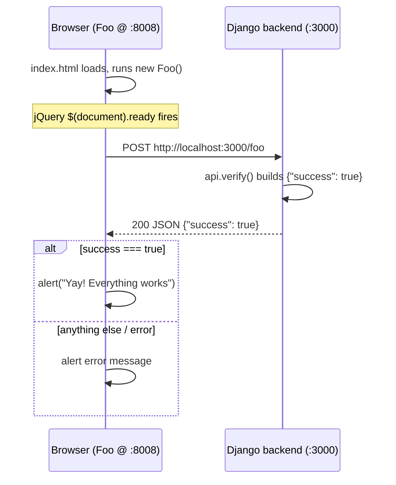

# Minicom — Project Flow

Minicom is a **prototype of Intercom's messaging widget architecture**, stripped down to the bare minimum. Its purpose is to prove that **two separate customer websites can each talk to a shared backend** — exactly how Intercom's chat widget (embedded on many different sites) communicates with Intercom's servers.

It is an interview setup exercise: if you can get both websites to pop up `Yay! Everything works`, your environment is correctly configured.

## The three moving parts

| Component | Served at | Role |
|-----------|-----------|------|
| **Foo website** | http://127.0.0.1:8008 | A mock customer site A |
| **Bar website** | http://127.0.0.1:8009 | A mock customer site B |
| **Django backend** | http://127.0.0.1:3000 | The shared "Intercom" server both sites call |

## How it works end-to-end

The Bar website is identical, just hitting `/bar` instead of `/foo`.

## Step-by-step detail

1. **Frontend load** — `foo-website/index.html` pulls in jQuery + Bootstrap, loads `foo.js`, then runs `new Foo()`. (`bar-website` mirrors this with `Bar`.)

2. **Auto-fire request** — In `foo-website/foo.js`, the `Foo` constructor sets `fooEndpoint = 'http://localhost:3000/foo'` and, once the DOM is ready, calls `verify()`, which does a jQuery `$.post()` to the Django server.

3. **Backend handling** — The request hits Django. In `django/minicom/urls.py`, both `foo` and `bar` paths route to the same handler, `api.verify`. In `django/minicom/api.py`, `verify()` simply returns JSON `{"success": true}`.

4. **Cross-origin** — Because the page (`:8008`) and the API (`:3000`) are different origins, this is a cross-origin request. `django/minicom/settings.py` enables `corsheaders` with `CORS_ORIGIN_ALLOW_ALL = True`, and CSRF middleware is deliberately disabled so the widget-style POST works.

5. **Frontend verdict** — Back in `verify()`, if `response.success === true` it fires `alert('Yay! Everything works')`; otherwise it alerts an error. This is the visual confirmation that frontend ↔ backend communication succeeds.

## Supporting pieces

- **Static file servers** — `script/foo/start` and `script/bar/start` do not use Django; they just serve the static HTML/JS/CSS folders. The scripts auto-detect an available tool (Ruby → PHP → `npx serve` → Python's `http.server`) to host the files on ports 8008/8009.
- **Django server** — `script/django/start` activates the virtual environment and runs `manage.py runserver 3000`.
- **Database** — A SQLite `db.sqlite3` exists and migrations run during setup, but the current `verify` endpoint does not actually use the DB. It is scaffolding for extending the app during the interview.

## The bigger intent

This mirrors Intercom's real model: **one backend, many embedding sites.** Foo and Bar represent different customer websites that both embed the same widget and must reliably reach the backend across origins. The exercise validates that your toolchain (Python/Django, a static file server, CORS) is correctly wired before the live interview — where you would likely extend these `/foo` and `/bar` endpoints with real behavior.
