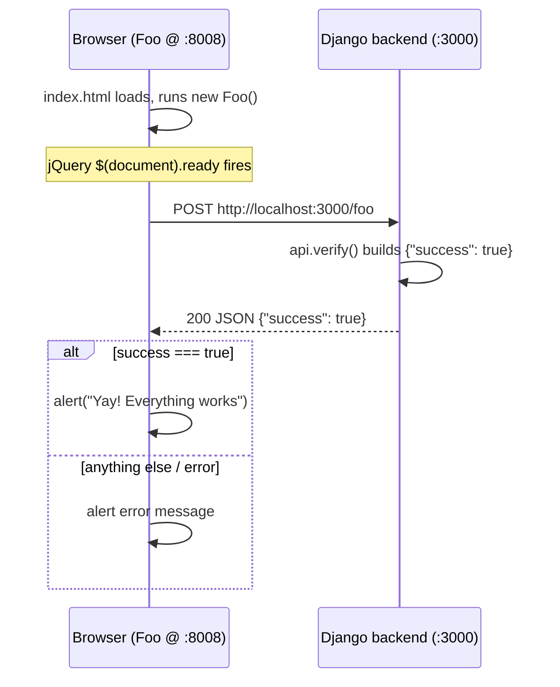

# Minicom — Project Flow

Minicom is a **prototype of Intercom's messaging widget architecture**, stripped down to the bare minimum. Its purpose is to prove that **two separate customer websites can each talk to a shared backend** — exactly how Intercom's chat widget (embedded on many different sites) communicates with Intercom's servers.

It is an interview setup exercise: if you can get both websites to pop up `Yay! Everything works`, your environment is correctly configured.

## The three moving parts

| Component | Served at | Role |
|-----------|-----------|------|
| **Foo website** | http://127.0.0.1:8008 | A mock customer site A |
| **Bar website** | http://127.0.0.1:8009 | A mock customer site B |
| **Django backend** | http://127.0.0.1:3000 | The shared "Intercom" server both sites call |

## How it works end-to-end



The Bar website is identical, just hitting `/bar` instead of `/foo`.

## Step-by-step detail

1. **Frontend load** — `foo-website/index.html` pulls in jQuery + Bootstrap, loads `foo.js`, then runs `new Foo()`. (`bar-website` mirrors this with `Bar`.)

2. **Auto-fire request** — In `foo-website/foo.js`, the `Foo` constructor sets `fooEndpoint = 'http://localhost:3000/foo'` and, once the DOM is ready, calls `verify()`, which does a jQuery `$.post()` to the Django server.

3. **Backend handling** — The request hits Django. In `django/minicom/urls.py`, both `foo` and `bar` paths route to the same handler, `api.verify`. In `django/minicom/api.py`, `verify()` simply returns JSON `{"success": true}`.

4. **Cross-origin** — Because the page (`:8008`) and the API (`:3000`) are different origins, this is a cross-origin request. `django/minicom/settings.py` enables `corsheaders` with `CORS_ORIGIN_ALLOW_ALL = True`, and CSRF middleware is deliberately disabled so the widget-style POST works.

5. **Frontend verdict** — Back in `verify()`, if `response.success === true` it fires `alert('Yay! Everything works')`; otherwise it alerts an error. This is the visual confirmation that frontend ↔ backend communication succeeds.

## Supporting pieces

- **Static file servers** — `script/foo/start` and `script/bar/start` do not use Django; they just serve the static HTML/JS/CSS folders. The scripts prefer Python's `http.server` and fall back to other available tools (Ruby → PHP → `npx serve`) to host the files on ports 8008/8009. The fallback version checks are silenced so missing tools do not print warnings.
- **Django server** — `script/django/start` activates the virtual environment and runs `manage.py runserver 3000`.
- **Database** — A SQLite `db.sqlite3` exists and migrations run during setup, but the current `verify` endpoint does not actually use the DB. It is scaffolding for extending the app during the interview.

## Backend implementation details

### Project layout

The Django project lives under `django/` and the Python package is `minicom/`:

| File | Role |
|------|------|
| `manage.py` | CLI entry point. Sets `DJANGO_SETTINGS_MODULE=minicom.settings` and dispatches commands like `runserver`, `makemigrations`, `migrate`. |
| `minicom/settings.py` | All configuration — installed apps, middleware, database, CORS. |
| `minicom/urls.py` | URL routing. Maps `foo` and `bar` to the same view, `api.verify`. |
| `minicom/api.py` | The actual request handler (`render_to_json` + `verify`). |
| `minicom/views.py` | Empty placeholder — unused; the logic lives in `api.py`. |
| `minicom/apps.py` | App config (`MinicomConfig`). |
| `minicom/wsgi.py` | WSGI entry point exposing `application` for production servers. |
| `minicom/migrations/` | Contains only `__init__.py` — the app ships no migrations (see below). |

### How the server runs

`script/django/start` runs the Django **development server** (`runserver`) on port 3000:

```bat
CALL .\django\Scripts\activate.bat
.\django\Scripts\python.exe .\django\manage.py runserver 3000
```

- `manage.py` points Django at `minicom.settings`.
- `runserver` boots Django's built-in WSGI dev server (auto-reload, single process). It is for local development only — not production.
- `wsgi.py` exposes the same app as `application` for a real WSGI host (gunicorn/uWSGI), but the dev server is what the script uses.

### Request handling

Routing is intentionally minimal — [django/minicom/urls.py](../django/minicom/urls.py):

```python
from minicom import api

urlpatterns = [
    path('foo', api.verify),
    path('bar', api.verify),
]
```

Both paths resolve to one handler in [django/minicom/api.py](../django/minicom/api.py):

```python
def render_to_json(content, **kwargs):
  return HttpResponse(json.dumps(content), content_type='application/json', **kwargs)

def verify(request):
  return render_to_json({'success': True})
```

`verify` ignores the request body entirely and always returns `{"success": true}` as JSON. It does **not** read or write the database — it only proves the request reached the backend.

### Why cross-origin calls succeed

The frontends run on ports 8008/8009 while the API is on 3000, so every call is cross-origin. Two settings in [django/minicom/settings.py](../django/minicom/settings.py) make this work:

- `corsheaders` is in `INSTALLED_APPS` and `CorsMiddleware` is in `MIDDLEWARE`, with `CORS_ORIGIN_ALLOW_ALL = True` and `CORS_URLS_REGEX = r'.*'` — so any origin may call any URL.
- `CsrfViewMiddleware` is **commented out** (`# FIXME: Disabled for widget API calls.`). Without this, the POSTs from foo/bar would be rejected for missing a CSRF token.

### SQLite database and migrations

The database is plain file-based SQLite, configured in `settings.py`:

```python
DATABASES = {
    'default': {
        'ENGINE': 'django.db.backends.sqlite3',
        'NAME': os.path.join(BASE_DIR, 'db.sqlite3'),
    }
}
```

`BASE_DIR` resolves to the `django/` folder, so the database file is `django/db.sqlite3`.

**The `minicom` app has no `models.py`**, so it defines no tables and ships no migrations — `migrations/` holds only `__init__.py`. That is why, during setup, `makemigrations` prints `No changes detected`.

What `migrate` *does* create are the tables for Django's **built-in** apps that are enabled in `INSTALLED_APPS` (`django.contrib.auth`, `django.contrib.contenttypes`, `django.contrib.messages`, `django.contrib.staticfiles`). Running `migrate` applies their bundled migrations, which is why setup logs lines like:

```
Applying contenttypes.0001_initial... OK
Applying auth.0001_initial... OK
...
```

The result is a `db.sqlite3` populated with framework tables (e.g. `auth_user`, `auth_group`, `django_content_type`), none of which the current `/foo` and `/bar` endpoints touch. The DB is pre-wired scaffolding: if the interview task adds a model, you would create `models.py`, run `makemigrations` + `migrate`, and the new table would appear here.

> **Note on schema changes with SQLite** — Django's migration autodetector works poorly against SQLite for incremental edits. The Django README recommends recreating the DB for schema changes: delete `db.sqlite3`, then `makemigrations` and `migrate` again.


## The bigger intent

This mirrors Intercom's real model: **one backend, many embedding sites.** Foo and Bar represent different customer websites that both embed the same widget and must reliably reach the backend across origins. The exercise validates that your toolchain (Python/Django, a static file server, CORS) is correctly wired before the live interview — where you would likely extend these `/foo` and `/bar` endpoints with real behavior.
